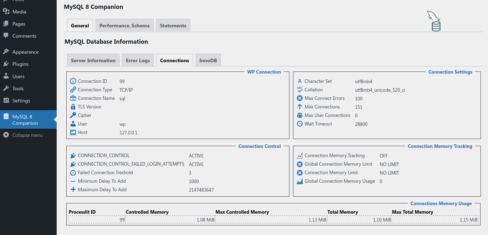

# MySQL 8 Companion

MySQL 8 Companion is a WordPress plugin that help the DBAs and the developers finding useful information.

The plugin is also compatibale with MySQL HeatWave Database Service on Oracle Cloud Infrastructure.

## General

### Server Information

### Error Logs

### Connections

### InnoDB

## Performance_Schema

### Summary

### Schema Design

## Statements

### Most Expensive

With Query Excution Plan:

### Slowest

### Full Table Scan

## MySQL HeatWave

